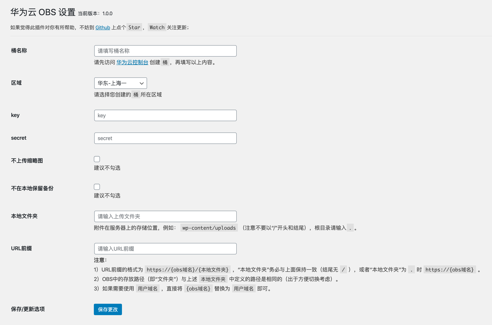

# OBS HuaWeiCloud

使用华为云对象存储服务 OBS 作为附件存储空间的 WordPress 插件

## 插件特色

* [x] 可配置是否上传缩略图和是否保留本地备份
* [x] 本地删除可同步删除华为云对象存储OBS中的文件
* [x] 支持华为云对象存储OBS绑定的用户域名
* [x] 支持替换数据库中旧的资源链接地址
* [x] 支持华为云对象存储OBS完整地域使用
* [x] 支持同步历史附件到华为云对象存储OBS
* [x] 支持上传文件自动重命名

## 安装

### 后台安装（推荐使用）

WordPress 后台安装插件页面搜索`OBS HuaWeiCloud`，点击安装

### 下载源码

从 GitHub 下载源码，通过 WordPress 后台上传安装，或者直接将源码上传到 WordPress 插件目录`wp-content/plugins`，然后在后台启用

GitHub 下载节点：[https://github.com/sy-records/huaweicloud-obs-wordpress/releases/latest](https://github.com/sy-records/huaweicloud-obs-wordpress/releases/latest)

## 修改配置

* 方法一：在 WordPress 插件管理页面有设置按钮，进行设置
* 方法二：在 WordPress 后台管理左侧导航栏`设置`下`华为云OBS设置`，点击进入设置页面

## 插件截图

